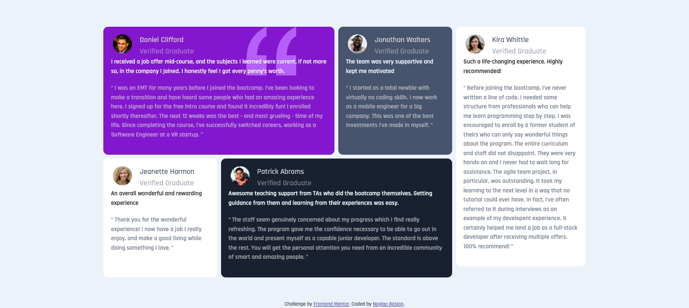
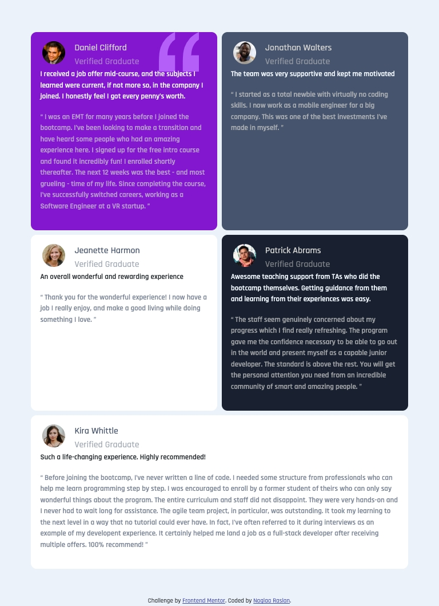
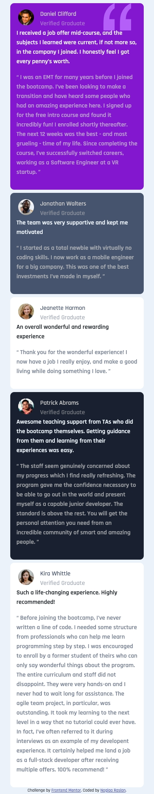

# Frontend Mentor - Testimonials grid section solution

This is a solution to the [Testimonials grid section challenge on Frontend Mentor](https://www.frontendmentor.io/challenges/testimonials-grid-section-Nnw6J7Un7). Frontend Mentor challenges help you improve your coding skills by building realistic projects. 

## Table of contents

- [Overview](#overview)
  - [The challenge](#the-challenge)
  - [Screenshot](#screenshot)
  - [Links](#links)
- [My process](#my-process)
  - [Built with](#built-with)
  - [What I learned](#what-i-learned)

- [Author](#author)

**Note: Delete this note and update the table of contents based on what sections you keep.**

## Overview

### The challenge

Users should be able to:

- View the optimal layout for the site depending on their device's screen size

### Screenshot

- Desktop : ;

- Ipad :

- Mobile :;

### Links

- Solution URL: [Github Solution Repo](https://github.com/codeAndcocoa/Testimonials-Grid-Section.git)
- Live Site URL: [Live site](https://codeandcocoa.github.io/Testimonials-Grid-Section/)

## My process

### Built with

- Semantic HTML5 markup
- CSS custom properties
- Sass
- Bootstrap 5
- Desktop-first workflow

**Note: These are just examples. Delete this note and replace the list above with your own choices**

### What I learned

- I learned to use sass and styly my project with Sass preprocessor language.

## Author

- Website - [Github profile](https://github.com/codeAndcocoa)
- Frontend Mentor - [@codeAndcocoa](https://www.frontendmentor.io/profile/codeAndcocoa)

